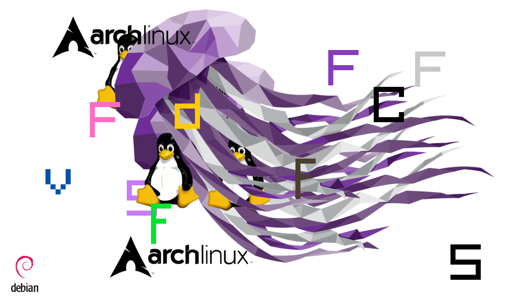

# BamBamTux

A `bambam` style game rewritten from scratch in `raylib`.



## Run


```sh
make && ./run.sh
```

or

```sh
./build_and_run.sh
```

Press `Esc` to quit.

## Done so far

- A symbol appears when a printable key is pressed.
- A `linux` logo appears when other keys are pressed.
- A random sound is played at any key press.

## To do

- [x] Random color for symbols (`red` now)
- [x] Lower case letters not just upper case
- [ ] Random size for logos
- [x] Sounds
- [x] A `Makefile` instead of the shell script
